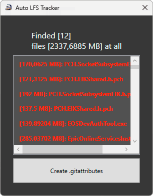

# Git Large Files Storage Auto Tracker

> [!NOTE]
>
> **Thit tool created for Windows OS**


## Description

​	This widget searches for files larger than ```99 megabytes``` in the working directory and creates a ```.gitattributes``` file with a list of these files.


 